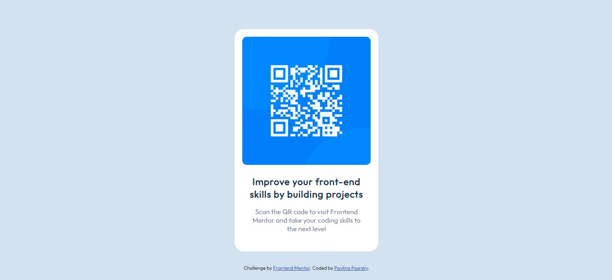

# Frontend Mentor - QR code component solution

This is a solution to the [QR code component challenge on Frontend Mentor](https://www.frontendmentor.io/challenges/qr-code-component-iux_sIO_H). Frontend Mentor challenges help you improve your coding skills by building realistic projects. 

## Table of contents

- [Overview](#overview)
  - [Screenshot](#screenshot)
  - [Links](#links)
- [My process](#my-process)
  - [Built with](#built-with)
  - [What I learned](#what-i-learned)
  - [Continued development](#continued-development)
  - [Useful resources](#useful-resources)
- [Author](#author)
- [Acknowledgments](#acknowledgments)

## Overview

### Screenshot

### Links

- Solution URL: https://github.com/PavlinaPs/QR-code-component
- Live Site URL: https://pavlinaps.github.io/QR-code-component/

## My process

### Built with

- Semantic HTML5 markup
- CSS custom properties
- Flexbox
- Mobile-first workflow

### What I learned

When adding the image in the layout I realized that there are two ways how to do it. In HTML file as an \ or in css file as background-image. I decided to add it in HTML this time and wrap in a \
 because of the flexbox. 

I also realized I need to check the layout on a big screen - I work on a notebook. Lesson learned from previous challenge (Interactive rating component). I found this page: https://bluetree.ai/screenfly/ where I can check it and it seems to do the job.

### Continued development

I want to be more concise and code faster and I am going to work on that.

## Author

- GitHub - [PavlinaPs](https://github.com/PavlinaPs)
- Frontend Mentor - [@PavlinaPs](https://www.frontendmentor.io/profile/PavlinaPs)
